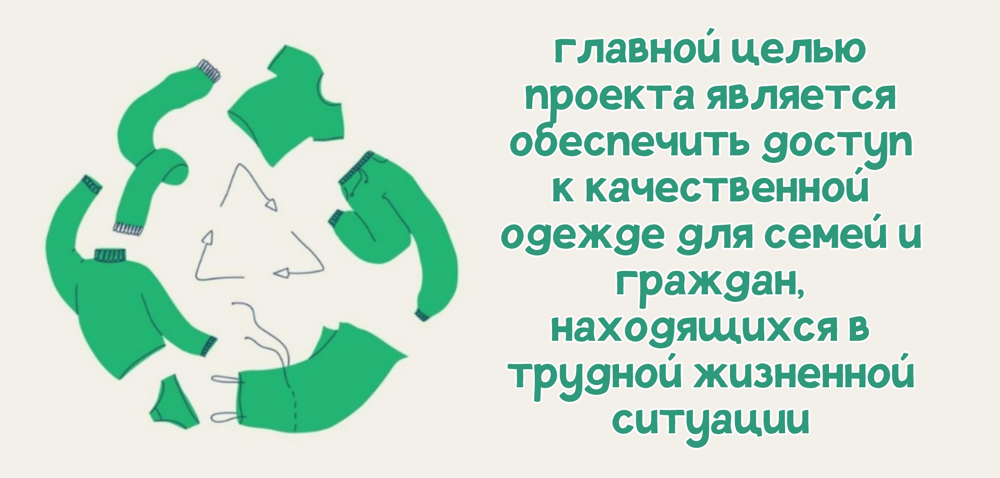
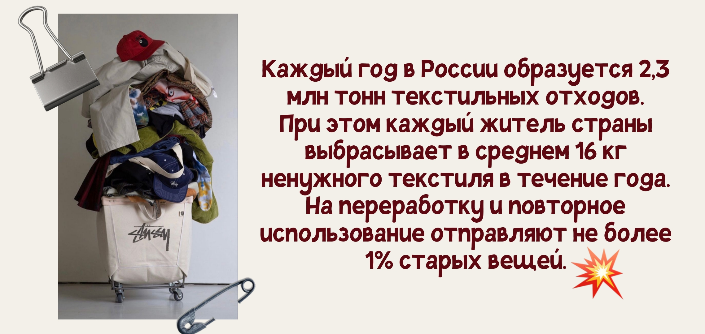

  

# Проект CLORING

**«CLORING»** - онлайн-платформа, где можно жертвовать или обмениваться одеждой. Её цель - *создать систему повторного использования текстиля*. Она поддерживает людей в трудных жизненных ситуациях, предоставляя им качественную одежду, нуждающиеся смогут получить помощь в приобретении одежды на безвозмездной основе, а также обменять неиспользуемую одежду на необходимую. Это улучшает их жизнь, давая возможность чувствовать себя уверенно и достойно без затрат на покупку новых вещей. *Проект является актуальным в данное время, так как проблема социального неравенства и материальной необеспеченности остаётся одной из наиболее значимых в современном обществе.* Проект выполнен в рамках предмета «Обучение служением».


---

## Основные функции

| Функция | Описание |
|---------|----------|
| **Обмен одеждой** | Выкладывайте свои вещи и обменивайте на вещи других пользователей |
| **Пожертвование** | Передавайте одежду малообеспеченным гражданам и получайте купоны ||
| **Каталог** | Удобный просмотр доступных для обмена вещей с фото и описанием |
| **Личный кабинет** | Управление добавленными вещами и просмотр информации |

---

## Технологии

- **Backend:** Flask 3.1, Python 3.11
- **Database:** SQLite
- **Frontend:** HTML, CSS, JavaScript
- **Развертывание:** Docker, Docker Compose

---

## Запуск
Сайт можно открыть, перейдя по [этой ссылке](51.250.23.129:8080) - 51.250.23.129:8080

---

## Структура проекта
```
CLORING-WEB/
├── src/                                  
│   ├── run.py                            # Главный файл, где собран весь функционал
│   ├── db.py                             # Работа с базой данных SQLite
│   ├── validation.py                     # Проверка корректности заполненных полей
│   ├── registration.py                   # Регистрация пользователей
│   ├── autotentification.py              # Аутентификация: доступ пользователю к профилю по паролю
│   ├── passwords.py                      # Хеширование паролей и сверяется пароль с хэшем в Базе Данных
│   ├── logger.py                         # Настройка логирования
│   └── constants.py                      # Константы: словари и списки
│
├── templates/                            
│   ├── main.html                         # Главная страница
│   ├── registration.html                 # Регистрация
│   ├── sign_in.html                      # Вход
│   ├── user_account.html                 # Личный кабинет
│   ├── upload_form.html                  # Форма добавления одежды
│   ├── catalog.html                      # Каталог вещей
│   ├── card.html                         # Карточка товара
│   ├── donation_form.html                # Форма пожертвования
│   ├── after_donation.html               # Страница после пожертвования
│   └── about.html                        # Страница "О нас"
│
├── tests/                                # Тесты
│   ├── test_valid_email.py
│   ├── test_valid_phone_number.py
│   ├── test_valid_clothes_name.py
│   ├── test_valid_clothes_brand.py
│   ├── test_valid_clothes_color.py
│   ├── test_valid_clothes_material.py
│   └── test_valid_clothes_description.py
│
├── uploads/                              # Загруженные фото
│
├── Dockerfile                            # Docker-образ
├── docker-compose.yml                    # Docker Compose конфигурация
├── requirements.txt                      # Зависимости проекта
└── README.md                             # Описание проекта
```
---

## Команда проекта
[Панарин Максим](https://github.com/Bezriska) - **Тимлид**. Отвечает за общее руководство проектом, координацию работы команды, распределение задач, контроль сроков выполнения, организацию совещаний и коммуникацию между участниками.

[Малинин Ярослав](https://github.com/collhoun) - **Backend-разработчик**. Отвечает за разработку серверной части приложения, проектирование и реализацию архитектуры базы данных, создание API, обеспечение безопасности данных, хеширование паролей и интеграцию фронтенд и бэкенд-компонентов системы.

[Китаева Дарья](https://github.com/knoksss) - **Frontend-разработчик**. Отвечает за разработку клиентской части веб-приложения, создание пользовательского интерфейса на основе дизайн-макетов, верстку страниц на HTML/CSS, реализацию адаптивного дизайна.

[Галанова Екатерина](https://github.com/galanovaxxx) - **Аналитик**. Проводит исследование целевой аудитории и анализ рынка, изучает статистические данные и потребности пользователей.

[Иващенко Юлия](https://github.com/jurolli) - **Frontend-разработчик**. Специализируется на реализации интерактивных элементов интерфейса, разработке системы фильтрации в каталоге товаров.

---


